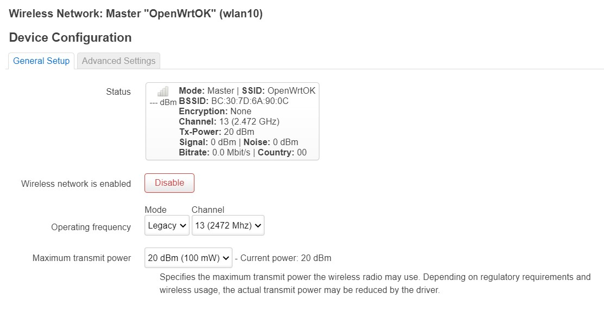
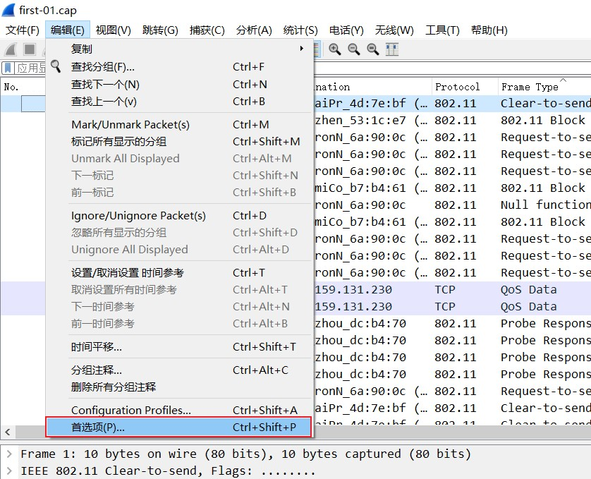
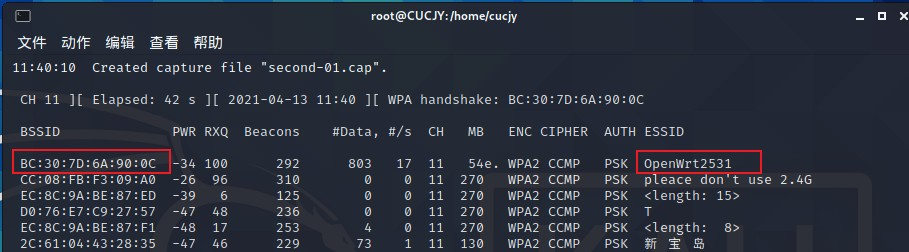

# 实验二：无线网络嗅探基础

# 实验目的

- 认识常见无线网络设备，了解基本使用和配置方法；
- 掌握使用 USB 无线网卡进行无线网络嗅探的基本方法；
- 了解无线网络嗅探的常用故障排错技术；
- 了解使用 Wireshark 进行 802.11 协议分析的基本方法；

# 实验环境

- 可以开启监听模式、AP 模式和数据帧注入功能的 USB 无线网卡；
- Kali 虚拟机；
- python scapy；
- aircrack-ng 系列软件；
- Wireshark；

# 实验要求

- 详细记录实验所使用的无线网卡基本信息；
  - 无线网卡正反面高清照片；
  - 该网卡的硬件和软件特性支持情况；
- （可选）通过无线路由器后台管理界面截图的方式，展示 自己搭建 的无线网络的基本配置信息；
- 使用 asciinema 记录一次典型的 airodump-ng 无线嗅探操作过程（限时 1 分钟之内），在 markdown 实验报告中附上 private 分享链接；
  - 开启监听模式；
  - channel hopping 模式抓包持续 10 秒左右；
  - 指定 channel 抓包持续 10 秒左右，并记录抓包结果到文件供后续分析；
- 使用 Wireshark 的 802.11 PSK 解密功能解密分析一个包含「浏览器访问 HTTP 明文通信网站的完整过程」的抓包结果文件；
- 回答 [第二章的实验练习题所有问题](https://c4pr1c3.github.io/cuc-mis/chap0x02/exp.html#%E5%AE%9E%E9%AA%8C%E7%BB%83%E4%B9%A0%E9%A2%98) ；

# 实验过程

## 记录实验所用设备及环境信息

本次实验"用于开启监听模式的网卡"正反面高清照片如下：


本次实验"用于开启监听模式的网卡"硬件和软件特性支持情况如下：


本次实验"用于开启无线网络的网卡"正反面高清照片如下：


本次实验"用于开启无线网络的网卡"硬件和软件特性支持情况如下：


本次实验所用无线网络环境的配置如下：





## airodump-ng 无线嗅探操作过程

通过无线网卡搭建好网络，使用电脑连接进行抓包实验：


抓包所执行的命令：

```
airmon-ng check kill

ifconfig

iwconfig

airmon-ng start wlan1

airodump-ng wlan1

airodump-ng wlan1 --channel 13 -w first --beacons --wps
```

[抓包一分钟录屏操作](https://asciinema.org/a/U7Yxuaz1TabeLOs5GoJHKDLh9)

（这里有一点小吐槽呀：限时一分钟有点考验手速，试了好多遍，时间都超了......最后是把命令提前打好复制粘贴才成功的）

抓包时通过浏览器访问 HTTP 明文通信网站（百度）浏览信息：


抓包成功：


## 使用Wireshark的解密功能解密分析

定制Wireshark主窗口显示列：


定制效果展示：


开启Wireshark的802.11 PSK解密功能：

点击‘编辑’菜单的‘首选项’：



Protocol->IEEE 802.11，填入已知共享密钥保存，勾选启用：Enable decryption功能。


## 回答实验练习题的所有问题

通过分析抓包保存的pcap文件：

- ### 查看统计当前信号覆盖范围内一共有多少独立的SSID？其中是否包括隐藏SSID？哪些无线热点是加密/非加密的？加密方式是否可知？

  为了得知SSID，首先在过滤器中输入命令 `wlan.fc.type_subtype == 0x08` ，过滤出管理帧 Beacon frame ，通过其中tag的SSID字段即可查看：

  

  如图，观察到了本次实验所用无线网络的SSID：

  

  #### 回答问题：通过观察，可知当前信号覆盖范围内一共有13个独立的SSID。

  想得知SSID是否被隐藏，还是需要查看 Beacon frame 的SSID字段，如果发现被0x00填充，就说明它被隐藏了：

  

   

  #### 回答问题：其中包括隐藏SSID，共有2个。

  要查看无线热点是否被加密，需要查看对应的 Beacon frame 的 `Fixed Parameters ——> Capabilities Information ——> Privacy` 字段是0还是1，若值为1则表示AP启用加密模式，值为0则没有，例如：

  

  上图名为 TP-Link_2332 的无线热点就启用了加密

  

  而我自建的无线热点 OpenWrtOK 就没有启用加密，和预先设置的一样

  #### 回答问题：除了自建的无线热点 OpenWrtOK 是非加密的以外，其他的无线热点都是加密的。

  如果想得知无线热点的加密方式，需要再查看 Authentication 帧中的 Authentication Algorithm 字段的值
  
  如果为0，则代表开放系统身份验证(Open System)，没有加密；如果为1，则代表使用共享密钥(Shared Key)加密方式，其他加密方式的编号保留使用：2~65535 

  不过尴尬的是，我在演示中抓到的包似乎不含有 Authentication 帧：

  

  这里我也不知道是为什么了，只好采用老师提供的数据样例包`wpa3.pacp`完成接下来的分析：

  

  可以看出 Authentication Algorithm 字段的值为3，代表使用同步对等身份验证(SAE)，它使用有限域加密来证明共享密码的知识；WPA3加密方式就使用SAE算法，取代了WPA2中的PSK算法

  ####  回答问题：加密方式是可知的，通过查看 Authentication 帧中的 Authentication Algorithm 字段的值。

- ### 如何分析出一个指定手机在抓包时间窗口内在手机端的无线网络列表可以看到哪些SSID？这台手机尝试连接了哪些SSID？最终加入了哪些SSID？

  第一个问题可以直接回答了，和上个问题基本相似：

  ####  回答问题：通过查看当前无线网络覆盖范围内 Beacon frame 中的SSID，可知该手机总共可以看到的SSID

  下面我们分析连接环节，首先进行一个初步扫描，查看周围有多少AP：

  

  查看到了自建的无线网络 OpenWrt2531 （此实验是在之前的抓包实验后几天进行的，室友后来决定将网络名改为这个名字，OpenWrtOK与OpenWrt2531是同一个网络，在此说明），其channel为11，因此只针对该channel进行下一步监听

  执行命令`airodump-ng wlan0 --channel 11 -w second`：

  

  在抓包的同时，用我的手机连接无线网络 OpenWrt2531 ：

  

  抓包成功后，在过滤器中输入命令 `wlan.fc.type_subtype == 0x0B` ，过滤出 Authentication 帧：

  

  可以看出，该连接的目的地址和AP的MAC地址一致：

  

  而源地址与我手机的MAC地址一致：

  

  成功证明我的手机向目标AP发出了auth请求，试图进行连接

  如果这个实验发到公开仓库的话，MAC地址我是会进行打码的，但是发到私有仓库，我还是蛮信任老师和师姐的，加个本机MAC地址会更有说服力一些(oﾟvﾟ)ノ

  ####  回答问题：通过查看该手机发送的 authentication frame，可以看到该手机试图连接了哪些SSID

  接着在过滤器中输入命令 `wlan.fc.type_subtype == 0x01` ，过滤出 Association Responce ：

  

  可以看到，目标AP向我的手机发送了 Association Responce ，证明连接成功了

  ####  回答问题：通过检查该手机收到的Association Response帧可以判断该手机最终加入了哪些SSID

- ### SSID包含在哪些类型的802.11帧？
  
  ####  回答问题：包含在——
  -  Probe Request frame(广播帧SSID 可能为空）
  -  Probe Response frame
  -  Beacon frame
  -  Authencition Request frame
  -  Authencition Responce frame

# 实验总结

- 对无线网络嗅探有了基本的认识并亲自动手实操了

- 对Wireshark的使用有了更深一步的了解，懂得了如何更好地分析数据包

- 了解了802.11协议的帧类型、帧格式、认证过程

- 并且通过第二个问题的探究，我明白了为什么在演示中抓到的包不含有 Authentication 帧：Authentication 帧是用于身份验证的，只有当某个节点向无线网络请求加入时才会发送，而在录制演示视频时没有发生这类操作，自然也就不会有这类帧了

# 参考资料

[实验课本](https://c4pr1c3.github.io/cuc-mis/chap0x02/exp.html)

[802.11简单认证过程](https://blog.csdn.net/eydwyz/article/details/70048858)

[常见帧类型的过滤器语法](https://zhiliao.h3c.com/Theme/details/102969)

[802.11帧格式详解](https://blog.csdn.net/eydwyz/article/details/54906882)

[802.11帧类型详解](https://www.cnblogs.com/juankai/p/11347416.html)

[WIFI系列协议--802.11](https://blog.csdn.net/qq_20677327/article/details/106748825)