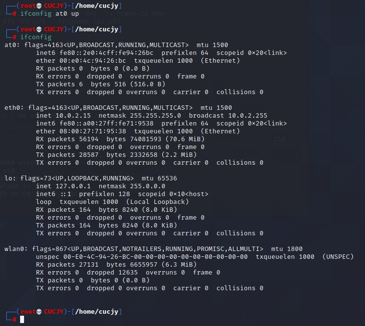

# 实验三：无线网络攻防独立实验之三  Evil Twin实验

# 实验目的

- 理解 Evil Twin 攻击原理并了解使用常见工具进行 Evil Twin 攻击的基本方法；

# 实验环境

本次实验用于"开启监听模式的网卡"正反面高清照片如下：


本次实验用于"开启监听模式的网卡"硬件和软件特性支持情况如下：


本次实验用于"搭建被攻击网络所需要使用到的「无线 AP」"正反面高清照片如下：


本次实验用于"搭建被攻击网络所需要使用到的「无线 AP」"硬件和软件特性支持情况如下：


本次实验所用无线网络环境的配置如下：


# 实验要求

- 实验对象严格限制为「自行搭建」的实验专用无线网络，不得对他人正常使用的无线网络造成负面影响；
- 实验报告附件材料应包括：
    - 实验中「捕获」的 实验相关 无线数据抓包文件；
- Evil Twin 实验自选 DNS 欺骗、明文通信数据嗅探、明文通信数据篡改 等常见中间人攻击手段，通过截图、GIF 动画 或 屏幕操作录像等方式展示被攻击无线客户端在被攻击时的「效果」或「体验」；

# 实验过程

先查看网卡是否支持AP模式：


可以看到支持的模式中没有AP，接下来需要手动进行配置

## 安装配置

首先执行命令`apt-get update && apt-get install bridge-utils`安装网络桥接配置工具包：


然后启用无线网卡并开启监听模式：


接着设置处于监听模式的网卡的工作channel，这里指定的是3：


再开启一个无认证和无加密机制的无线热点，由于是在宿舍做的，就起了宿舍WiFi的同名，执行命令`airbase-ng --essid TP-LINK_A88A wlan0`：


此时在手机上已经可以发现它了，但会显示没有网络：


接着创建桥接网卡，命名为mitm：


启动前述步骤创建的虚拟网卡：



然后添加有线网卡到桥接网卡，并且添加虚拟无线SoftAp模式网卡到桥接网卡：


使用如下命令配置桥接网络，使其能够联网：

```
ifconfig eth0 0.0.0.0 up
ifconfig at0 0.0.0.0 up
ifconfig mitm up
```


网络配置成功，在手机上进行测试，成功连接并可以正常上网：


## 抓包分析

开始抓包：


为了体验Evil Twin的攻击性，我选择了`明文通信数据嗅探`作为攻击手段，抓包的同时，在手机上浏览http明文网站，可以看到，部分通信内容例如浏览的网站可以直接被看到：


查看http返回的应答，也可以直接看到传回的data部分：


由此可见，一旦连接上钓鱼网络，受害者浏览的信息就被攻击者尽收眼底了，我们应该提高安全意识，不轻易连接无密码的陌生网络，遇见同名的网络也要留个心眼

# 实验总结

- Evil Twin的原理：把恶意AP的名字改成受害者之前连接过的网络的名字，来诱骗别人连接上

- 建立连接后，攻击者可以替换网页，比如把付费界面替换成攻击者自制的类似界面，给受害人造成经济损失，另外也可以通过连接一定程度上的窃取受害者电脑上的信息

- 对于有无线接入需求的人，最好有这样一个配置选项，即“允许用户连接到一个安全的无线网络”，而不只是“警告用户连接到不安全的网络”中

# 实验遇到的问题及解决方法

在启动桥接网络配置时可能失败，原因是没有分配IP地址：


此时需要手动进行地址分配，即可成功联网：


# 参考文献

[老师课本](https://c4pr1c3.github.io/cuc-mis/chap0x03/exp.html)