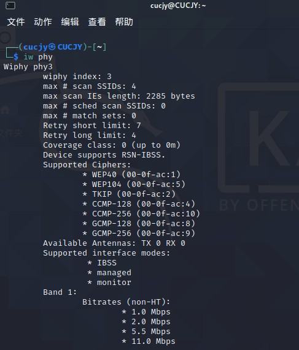
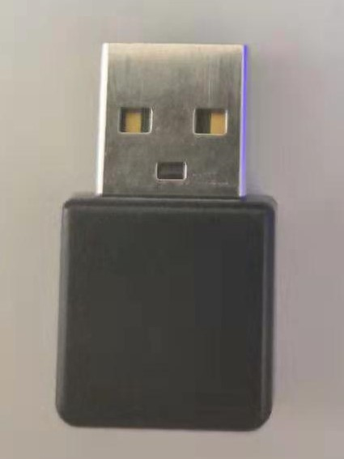
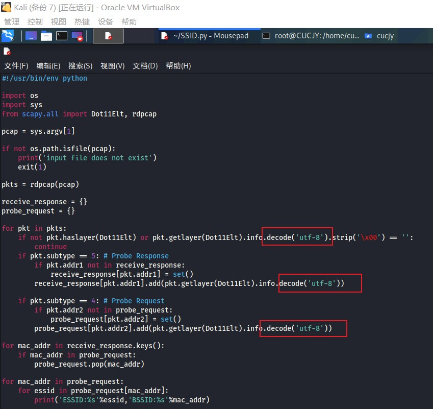

# 实验三：无线网络攻防独立实验之二  隐藏ESSID发现实验

# 实验目的

- 理解隐藏 ESSID 发现的基本原理，掌握使用 scapy 编程完成 ESSID 自动识别和提取的方法；

# 实验环境

本次实验用于"开启监听模式的网卡"正反面高清照片如下：

本次实验用于"开启监听模式的网卡"硬件和软件特性支持情况如下：

本次实验用于"搭建被攻击网络所需要使用到的「无线 AP」"正反面高清照片如下：

本次实验用于"搭建被攻击网络所需要使用到的「无线 AP」"硬件和软件特性支持情况如下：

本次实验所用无线网络环境的配置如下：

# 实验要求

- 实验对象严格限制为「自行搭建」的实验专用无线网络，不得对他人正常使用的无线网络造成负面影响；
- 实验报告附件材料应包括：
    - 实验中「捕获」的 实验相关 无线数据抓包文件；
    - 隐藏 ESSID 发现实验应提供 python 源代码并对指定 pcap 文件处理后自动输出所有发现的隐藏无线网络的：ESSID, BSSID，Channel；

# 实验过程

首先进行初步扫描，观察一下周边的网络环境：

发现有若干ESSID长度为0的AP，可以认为附近有隐藏的ESSID

运行编写好的python程序（见code文件夹），抓取数据包，然后进行自动化的隐藏SSID发现

结果如图，成功输出了隐藏无线网络的ESSID、BSSID以及channel：

其中第一个是我自己设置隐藏的无线网络，输出的信息完全一致：

# 实验遇到的问题及解决方法

在程序编写过程中有若干报错，一开始我是犯了没有转换格式的问题，发生报错：

定位到源代码处，发现用于和空比较的不是str：

一般这种情况把数据转变为utf-8格式即可解决：

但是随即又出现了报错，这种类型的报错我推测多半是有中文的原因，毕竟有很多无线网络的SSID取的是中文名：

继续在网络上搜索解决方案，先后尝试过`GB2312`、`gbk`、`ISO-8859-1`格式，均没有成功，最后使用`unicode_escape`格式解决了问题：

根据老师的描述，最初我的设想是用代码对已经抓到的包做静态分析，但是很快发现了问题：在已经抓到的包中，SSID为空的包怎么分析SSID仍旧是为空的，得不到被隐藏起来的SSID

于是我采用动态的做法：发现隐藏SSID以后，使用deauth攻击使其强制下线，再次获得beacon frame，这样就能成功破解：

# 实验总结

- 本次实验的重点是python+scapy的编程，通过通过haslayer()判断指定的数据报文层是否存在，若存在，则通过getlayer()来解析出该层数据，最后通过对象访问操作符 . 来读取具体的报文字段值

- BSSID是AP的MAC地址，ESSID可以近似理解为SSID，是AP的名字

- 编程的思路是：
  
  - 遍历数据包，如果是Beacon frame，就看它的info是否为空，如果为空就说明名字被隐藏起来了，如果它不在hidden_ssid_aps集合里，就把它加入，然后针对这个地址发动deauth攻击，使无线网络掉线

  - 然后查看Probe Resp包，它的MAC地址与之前记录的隐藏无线网络一致，就说明收到了回馈，将它的BSSID、ESSID、Channel打印出来

# 参考文献

[老师课本](https://c4pr1c3.github.io/cuc-mis/chap0x03/scapy.html)

[Python：出现UnicodeDecodeError: 'utf-8'问题](https://www.cnblogs.com/xiaolan-Lin/p/11653432.html)