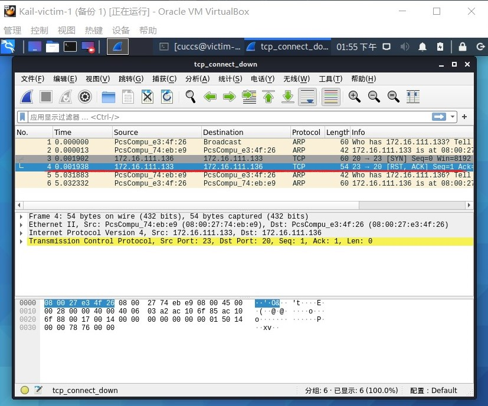
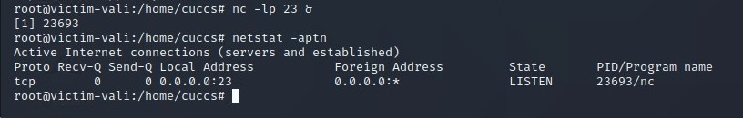
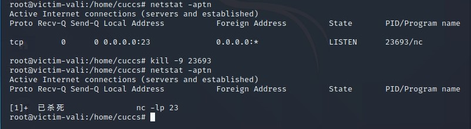
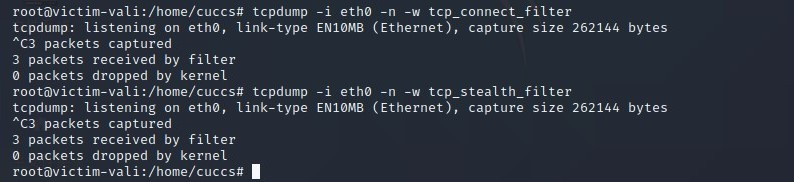

# 网络安全第五章实验报告  

## 基于 Scapy 编写端口扫描器  

### 实验目的  

* 掌握网络扫描之端口状态探测的基本原理  

### 实验环境  
* python + scapy 2.4.3  
* nmap  

## 绘制本次实验的网络拓扑图如下


## 实验要求

- [x] 禁止探测互联网上的 IP ，严格遵守网络安全相关法律法规

- [x] 完成以下扫描技术的编程实现

  - TCP connect scan / TCP stealth scan

  - TCP Xmas scan / TCP fin scan / TCP null scan

  - UDP scan

- [x] 上述每种扫描技术的实现测试均需要测试端口状态为：`开放`、`关闭` 和 `过滤` 状态时的程序执行结果
- [x] 提供每一次扫描测试的抓包结果并分析与课本中的扫描方法原理是否相符？如果不同，试分析原因
   - 相符
- [x] 在实验报告中详细说明实验网络环境拓扑、被测试 IP 的端口状态是如何模拟的

# 实验过程

## TCP connect scan

实验前的预期：

倘若攻击者向靶机发送SYN包，能完成三次握手，收到ACK，则端口为开放状态；若只收到一个RST包，则端口为关闭状态；倘若什么都没收到，即为端口过滤状态。

### 实验代码：

```
#!/usr/bin/env python
from scapy.all import *

def tcpconnect_scan(dst_ip , dst_port , timeout = 10):
    pkts = sr1(IP(dst = dst_ip) / TCP(dport = dst_port , flags = "S") , timeout = timeout)
    if (pkts is None):
       print ("filter")
    elif (pkts.haslayer(TCP)):
       if (pkts[1].flags == 'AS'):
            print ("Open")
       elif (pkts[1].flags == 'AR'):
            print ("Close")

tcpconnect_scan('172.16.111.133',23) 
```

### 端口关闭状态：

首先使用`netstat -aptn`命令检查靶机的端口状态：


可以看出此时没有开启的端口。

在靶机开启tcpdump（`tcpdump -i eth0 -n -w tcp_connect_down`），进行抓包，并将抓包结果保存：


在攻击主机运行扫描程序（`sudo python3 TCP_connect_scan.py`）：


可以看出此时端口处于关闭状态。

打开靶机的抓包结果进行验证：



可以看出只收到一个RST包，与预期状态相符。

### 端口开启状态：

使用`nc -lp 端口号 &`命令开启23端口：



可以看出端口开启成功。

在靶机开启tcpdump（`tcpdump -i eth0 -n -w tcp_connect_up`），进行抓包，并将抓包结果保存：


在攻击主机运行扫描程序（`sudo python3 TCP_connect_scan.py`）：


可以看出此时端口成功开启。

打开靶机的抓包结果进行验证：


三次握手成功，与预期状态相符。

### 端口过滤状态：

在靶机添加23端口过滤规则(`iptables -A INPUT -p tcp --dport 23 -j DROP`)：


可以看到，23端口仍然在工作，只是被添加了过滤状态。

在靶机开启tcpdump（`tcpdump -i eth0 -n -w tcp_connect_filter`），进行抓包，并将抓包结果保存：


在攻击主机运行扫描程序（`sudo python3 TCP_connect_scan.py`）：


可以看出此时端口处于过滤状态。

打开靶机的抓包结果进行验证：


如图所示，只抓到一个TCP包，其他什么也没收到，与预期状态相符。

## TCP stealth scan

实验前的预期状态：

stealth扫描和connect扫描十分近似，它们的预期状态是一样的。

### 实验代码：

```
#!/usr/bin/env python
from scapy.all import *

def tcpstealth_scan(dst_ip , dst_port , timeout = 10):
    pkts = sr1(IP(dst=dst_ip)/TCP(dport=dst_port,flags="S"),timeout=10)
    if (pkts is None):
        print ("Filtered")
    elif(pkts.haslayer(TCP)):
        if(pkts.getlayer(TCP).flags == 0x12):
            send_rst = sr(IP(dst=dst_ip)/TCP(dport=dst_port,flags="R"),timeout=10)
            print ("Open")
        elif (pkts.getlayer(TCP).flags == 0x14):
            print ("Closed")
        elif(pkts.haslayer(ICMP)):
            if(int(pkts.getlayer(ICMP).type)==3 and int(stealth_scan_resp.getlayer(ICMP).code) in [1,2,3,9,10,13]):
                print ("Filtered")

tcpstealth_scan('172.16.111.133',23)
```

### 端口关闭状态：

首先关闭掉之前的过滤规则，输入两条命令：
`iptables -I INPUT -p tcp --dport 23 -j ACCEPT`，`iptables -I INPUT -p tcp --sport 23 -j ACCEPT`

现在测试端口关闭状态，先把23端口关闭：寻找23端口程序占用的PID，将其kill掉



在靶机开启tcpdump（`tcpdump -i eth0 -n -w tcp_stealth_down`），进行抓包，并将抓包结果保存：


在攻击主机运行扫描程序（`sudo python3 TCP_stealth_scan.py`）：


可以看出此时端口处于关闭状态。

打开靶机的抓包结果进行验证：


可以看出只收到一个RST包，与预期状态相符。

### 端口开启状态：

使用`nc -lp 端口号 &`命令开启23端口：


可以看出端口开启成功。

在靶机开启tcpdump（`tcpdump -i eth0 -n -w tcp_connect_up`），进行抓包，并将抓包结果保存：


在攻击主机运行扫描程序（`sudo python3 TCP_stealth_scan.py`）：


可以看出此时端口成功开启。

打开靶机的抓包结果进行验证：


三次握手成功，与预期状态相符。

### 端口过滤状态：

在靶机添加23端口过滤规则(`iptables -A INPUT -p tcp --dport 23 -j DROP`)：

在靶机开启tcpdump（`tcpdump -i eth0 -n -w tcp_stealth_filter`），进行抓包，并将抓包结果保存：




在攻击主机运行扫描程序（`sudo python3 TCP_stealth_scan.py`）：


可以看出此时端口处于过滤状态。

打开靶机的抓包结果进行验证：


如图所示，只抓到一个TCP包，与预期状态相符。

## TCP Xmas scan

实验前的预期状态：

TCP Xmas scan是一种隐蔽性扫描，当端口处于关闭状态时，会回复一个RST包，其余所有状态都将不回复。

### 实验代码

```
#!/usr/bin/env python
from scapy.all import *

def Xmas_scan(dst_ip , dst_port , timeout = 10):
    pkts = sr1(IP(dst=dst_ip)/TCP(dport=dst_port,flags="FPU"),timeout=10)
    if (pkts is None):
        print ("Open|Filtered")
    elif(pkts.haslayer(TCP)):
        if(pkts.getlayer(TCP).flags == 0x14):
            print ("Closed")
    elif(pkts.haslayer(ICMP)):
        if(int(pkts.getlayer(ICMP).type)==3 and int(pkts.getlayer(ICMP).code) in [1,2,3,9,10,13]):
            print ("Filtered")

Xmas_scan('172.16.111.133',23)
```

### 端口关闭状态：

首先关闭掉之前的过滤规则，输入两条命令：
`iptables -I INPUT -p tcp --dport 23 -j ACCEPT`，`iptables -I INPUT -p tcp --sport 23 -j ACCEPT`

重复之前的操作：把23端口关闭，寻找23端口程序占用的PID，将其kill掉

在靶机开启tcpdump（`tcpdump -i eth0 -n -w tcp_Xmas_down`），进行抓包，并将抓包结果保存：


在攻击主机运行扫描程序（`sudo python3 TCP_Xmas_scan.py`）：


可以看出此时端口处于关闭状态。

打开靶机的抓包结果进行验证：


只回复了一个RST包，与预计状态相符合。

### 端口开启状态：

使用`nc -lp 端口号 &`命令开启23端口

在靶机开启tcpdump（`tcpdump -i eth0 -n -w tcp_Xmas_up`），进行抓包，并将抓包结果保存：


在攻击主机运行扫描程序（`sudo python3 TCP_Xmas_scan.py`）：


可以看出此时端口成功开启。

打开靶机的抓包结果进行验证：


没有包回应，与预计状态相符合。

### 端口过滤状态：

在靶机添加23端口过滤规则(`iptables -A INPUT -p tcp --dport 23 -j DROP`)

在靶机开启tcpdump（`tcpdump -i eth0 -n -w tcp_Xmas_filter`），进行抓包，并将抓包结果保存：


在攻击主机运行扫描程序（`sudo python3 TCP_Xmas_scan.py`）：


可以看出此时端口处于过滤状态。

打开靶机的抓包结果进行验证：


如图所示，没有回应包，与预期状态相符。

## TCP FIN scan

实验前的预期状态：

FIN数据包能够通过只监测SYN包的包过滤器，隐蔽性较⾼，与Xmas扫描十分相似，只是发送的包为FIN包。同理，收到RST包说明端口处于关闭状态；反之说明为开启/过滤状态。

### 实验代码

```
#!/usr/bin/env python
from scapy.all import *


def fin_scan(dst_ip , dst_port , timeout = 10):
    pkts = sr1(IP(dst=dst_ip)/TCP(dport=dst_port,flags="F"),timeout=10)
    if (pkts is None):
        print ("Open|Filtered")
    elif(pkts.haslayer(TCP)):
        if(pkts.getlayer(TCP).flags == 0x14):
            print ("Closed")
    elif(pkts.haslayer(ICMP)):
        if(int(pkts.getlayer(ICMP).type)==3 and int(pkts.getlayer(ICMP).code) in [1,2,3,9,10,13]):
            print ("Filtered")

fin_scan('172.16.111.133',23)
```

### 端口关闭状态：

在靶机开启tcpdump（`tcpdump -i eth0 -n -w tcp_FIN_down`），进行抓包，并将抓包结果保存：


在攻击主机运行扫描程序（`sudo python3 TCP_FIN_scan.py`）：


可以看出此时端口处于关闭状态。

打开靶机的抓包结果进行验证：


只收到了一个RST包，与预计状态相符合。

### 端口开启状态：

使用`nc -lp 端口号 &`命令开启23端口

在靶机开启tcpdump（`tcpdump -i eth0 -n -w tcp_FIN_up`），进行抓包，并将抓包结果保存：


在攻击主机运行扫描程序（`sudo python3 TCP_FIN_scan.py`）：


可以看出此时端口成功开启。

打开靶机的抓包结果进行验证：


如图所示，没有TCP回应包，与预期结果相符。

### 端口过滤状态：

在靶机添加23端口过滤规则(`iptables -A INPUT -p tcp --dport 23 -j DROP`)

在靶机开启tcpdump（`tcpdump -i eth0 -n -w tcp_FIN_filter`），进行抓包，并将抓包结果保存：


在攻击主机运行扫描程序（`sudo python3 TCP_FIN_scan.py`）：


可以看出此时端口处于过滤状态。

打开靶机的抓包结果进行验证：


如图所示，未收到TCP回应包，与预期状态相符。

## TCP null scan

实验前的预期状态：

发送的包中关闭所有TCP报⽂头标记，实验结果预期还是同理：收到RST包说明端口为关闭状态，未收到包即为开启/过滤状态。

### 实验代码

```
#!/usr/bin/env python
from scapy.all import *

def null_scan(dst_ip , dst_port , timeout = 10):
    pkts = sr1(IP(dst=dst_ip)/TCP(dport=dst_port,flags=""),timeout=10)
    if (pkts is None):
        print ("Open|Filtered")
    elif(pkts.haslayer(TCP)):
        if(pkts.getlayer(TCP).flags == 0x14):
            print ("Closed")
    elif(pkts.haslayer(ICMP)):
        if(int(pkts.getlayer(ICMP).type)==3 and int(pkts.getlayer(ICMP).code) in [1,2,3,9,10,13]):
            print ("Filtered")

null_scan('172.16.111.133',23)
```

### 端口关闭状态：

重复之前的操作：把23端口关闭，寻找23端口程序占用的PID，将其kill掉

在攻击主机运行扫描程序（`sudo python3 TCP_null_scan.py`）：


可以看出此时端口处于关闭状态。

打开靶机的抓包结果进行验证：


只收到了一个RST包，与预计状态相符合。

### 端口开启状态：

使用`nc -lp 端口号 &`命令开启23端口

在靶机开启tcpdump（`tcpdump -i eth0 -n -w tcp_null_up`），进行抓包，并将抓包结果保存：


在攻击主机运行扫描程序（`sudo python3 TCP_null_scan.py`）：


可以看出此时端口成功开启。

打开靶机的抓包结果进行验证：


没有回复包，与预期状态相同。

### 端口过滤状态：

在靶机添加23端口过滤规则(`iptables -A INPUT -p tcp --dport 23 -j DROP`)

在靶机开启tcpdump（`tcpdump -i eth0 -n -w tcp_null_filter`），进行抓包，并将抓包结果保存：


在攻击主机运行扫描程序（`sudo python3 TCP_null_scan.py`）：


可以看出此时端口处于过滤状态。

打开靶机的抓包结果进行验证：


如图所示，没有回复包，与预期状态相同。

## UDP scan

实验前的预期状态：

这是一种开放式扫描，通过发送UDP包进行扫描。当收到UDP回复时，该端口为开启状态；否则即为关闭/过滤状态。

### 实验代码

```
#!/usr/bin/env python
from scapy.all import *

def udp_scan(dst_ip,dst_port,dst_timeout = 10):
    udp_scan_resp = sr1(IP(dst=dst_ip)/UDP(dport=dst_port),timeout=dst_timeout)
    if (udp_scan_resp is None):
        print("Open|Filtered")
    elif (udp_scan_resp.haslayer(UDP)):
        print("Open")
    elif(udp_scan_resp.haslayer(ICMP)):
        if(int(udp_scan_resp.getlayer(ICMP).type)==3 and int(udp_scan_resp.getlayer(ICMP).code)==3):
            print("Closed")
        elif(int(udp_scan_resp.getlayer(ICMP).type)==3 and int(udp_scan_resp.getlayer(ICMP).code) in [1,2,9,10,13]):
            print("Filtered")
        elif(udp_scan_resp.haslayer(IP) and udp_scan_resp.getlayer(IP).proto==IP_PROTOS.udp):
            print("Open")

udp_scan('172.16.111.133',53)
```

### 端口关闭状态：

此时UDP端口都处于关闭状态


在靶机开启tcpdump（`tcpdump -i eth0 -n -w udp_down`），进行抓包，并将抓包结果保存：


在攻击主机运行扫描程序（`sudo python3 udp_scan.py`）：


可以看出此时端口处于关闭状态。

打开靶机的抓包结果进行验证：


看到抓到的ICMP包type/code均为3，且确实未收到UDP回复包，与预期状态相符。

### 端口开启状态：

使用`nc -l -u -p 53`命令开启53端口，此命令会在短暂时间内监听53端口，趁这一时刻在攻击主机运行扫描程序（`sudo python3 udp_scan.py`）：


可以看出此时端口成功开启。

打开靶机的抓包结果进行验证：


### 端口过滤状态：

在靶机添加53端口过滤规则(`iptables -A INPUT -p tcp --dport 53 -j DROP`)

在攻击主机运行扫描程序（`sudo python3 udp_scan.py`）：


可以看出此时端口处于过滤状态。

打开靶机的抓包结果进行验证：


如图所示，未收到UDP回复，与预期状态相符。

## 针对上次批改进行的改进

上次师哥批改作业时提出的意见：图片命名不要采用无意义的数字，实验报告里贴的图空白太多了，绘制一张「网络拓扑图」说明实验环境

本次实验对师哥的意见做出了改进：所有的图片均做到了见名知意，裁剪了不必要的空白，自己绘制一张网络拓扑图说明实验环境

#### 参考资料  
[网络安全教材第五章](https://c4pr1c3.github.io/cuc-ns/chap0x05/main.html)  
[网络安全第五章课件](https://c4pr1c3.github.io/cuc-ns-ppt/chap0x05.md.html#/3/1)  
[2019-NS-Public-chencwx](https://github.com/CUCCS/2019-NS-Public-chencwx/blob/ns_chap0x05/ns_chapter5/%E7%BD%91%E7%BB%9C%E6%89%AB%E6%8F%8F%E5%AE%9E%E9%AA%8C%E6%8A%A5%E5%91%8A.md)  