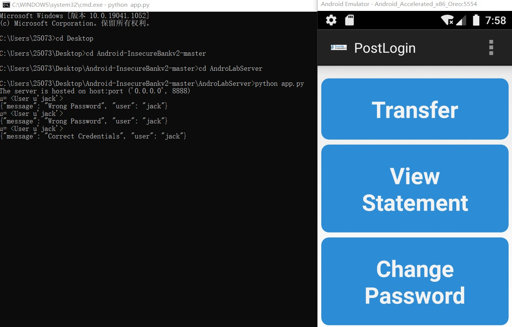
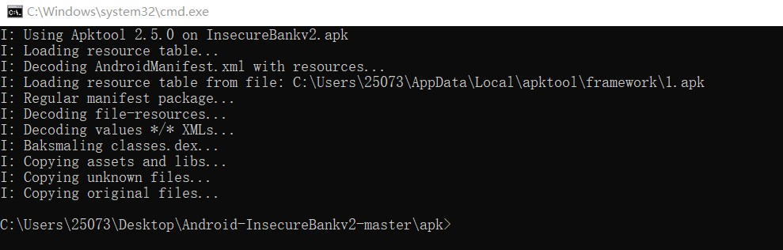
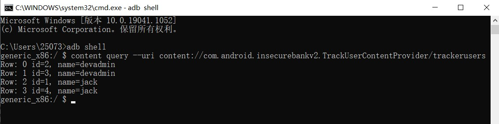

# 实验八：Android 缺陷应用漏洞攻击实验

# 实验目的

- 理解 Android 经典的组件安全和数据安全相关代码缺陷原理和漏洞利用方法；
- 掌握 Android 模拟器运行环境搭建和 ADB 使用；

# 实验环境

[Android-InsecureBankv2](https://github.com/c4pr1c3/Android-InsecureBankv2)

Windows10本机

# 实验要求

详细记录实验环境搭建过程，至少完成以下实验：
- [x] Developer Backdoor
- [x] Insecure Logging
- [x] Android Application patching + Weak Auth
- [x] Exploiting Android Broadcast Receivers
- [x] Exploiting Android Content Provider
- （可选）使用不同于 Walkthroughs 中提供的工具或方法达到相同的漏洞利用攻击效果；推荐 drozer

# 实验过程

## 环境搭建

### 服务器端环境搭建

首先clone最新的[仓库](https://github.com/c4pr1c3/Android-InsecureBankv2)：


接着安装程序运行所依赖的python库文件，安装过程详见 [实验遇到的问题及解决方法] ：


库安装完毕后执行指令`pipenv shell`进入pipenv环境，然后开启python服务器：


至此，服务器端环境搭建完成。

### 用户端环境搭建

进入Android Studio的AVD Manager，新建或使用之前的AVD：


AVD启动后执行指令`adb install InsecureBankv2.apk`，将客户端安装到模拟器上：


如图所示，安装成功：


至此，用户端环境搭建完成。

### 登录测试

使用默认账号密码登录成功：

```
jack/Jack@123$ 
dinesh/Dinesh@123$
```



## 正式实验

### 1. Developer Backdoor

首先解压之前下载的apk文件：


下载工具[dex2jar](https://github.com/pxb1988/dex2jar/releases/download/2.0/dex-tools-2.0.zip)，将解压得到的 classes.dex 文件移动到该工具文件夹中：


使用脚本 d2j-dex2jar.bat 生成原java代码编译后产生的jar文件：


下载工具[jadx](https://github.com/skylot/jadx/releases/download/v1.2.0/jadx-1.2.0.zip)，查看之前生成的jar文件：


通过观察代码，我们发现了一个开发人员后门——用户"devadmin"可以到达与其他用户不同的界面，而且可以用任意一个密码登录成功：


日志上也成功记录下了这一信息：


### 2. Insecure Logging

继续查看源码，在ChangePassword中发现新改的密码会被输出：


尝试更改密码：


随后查看日志，密码明文果然被输出了，可见这个日志确实不太安全：


### 3. Android Application patching + Weak Auth

下载反编译工具[Apktool](https://ibotpeaches.github.io/Apktool/install/)，执行指令`apktool d InsecureBankv2.apk`对apk文件进行反编译：



找到位于 InsecureBankv2/res/values 的strings.xml文件，把"is_admin"的值从"no"修改为"yes"：


再回到之前的文件夹，执行指令`apktool b InsecureBankv2.apk`重新编译应用程序：


可以看到在 dist 文件夹中编译出了新的apk文件：


下载Android签名工具[SignApk](https://github.com/appium-boneyard/sign/archive/refs/heads/master.zip)，对新apk文件签名，执行指令：

`java -jar signapk.jar testkey.x509.pem testkey.pk8 InsecureBankv2.apk InsecureBankv2.s.apk`

即可生成一个名为 InsecureBankv2.s.apk 的新签名apk文件：


将这个文件复制到Android SDK的 platform-tools 文件夹下，然后安装这个新的apk到模拟器上：


看到出现了一个额外的“创建用户”按钮，该按钮以前不存在：


### 4. Exploiting Android Broadcast Receivers

进行同上的反编译操作，打开 AndroidManifest.xml 文件，阅读代码，发现了应用程序中声明的广播接收器：


再使用 jadx 查看之前生成的jar文件，寻找相关源码，在 ChangePassword 中找到了传递的参数：


在 MyBroadCastReceiver 中找到了参数传递语句：


进入 adb shell ，执行指令：

`am broadcast -a theBroadcast -n com.android.insecurebankv2/com.android.insecurebankv2.MyBroadCastReceiver --es phonenumber 5554 --es newpass Dinesh@123!`


在模拟器中即可收到带有密码的SMS文本消息短信：


### 5. Exploiting Android Content Provider

再次打开 AndroidManifest.xml 文件，阅读代码，发现用户内容提供者跟踪模块：


再使用 jadx 查看之前生成的jar文件，寻找相关源码，在 TrackUserContentProvider 中找到相关参数：


进入 adb shell ，执行指令：

`content query --uri content://com.android.insecurebankv2.TrackUserContentProvider/trackerusers`

可以看到，所有用户的登录历史都未加密地存储在设备上：



# 实验遇到的问题及解决方法

在安装运行服务器所需的python库时遇到问题：

此时正在执行指令`pipenv install -r requirements.txt --two`


遇到了未知的报错


解决方法：转用指令`pip2 install -r requirements.txt`进行下载


# 实验总结

- 深入学习并实践了Android编译与反编译的一般流程

- 了解了Android程序编写的一些典型漏洞，对攻防概念有了更深刻的认识

# 参考文献

[老师课本](https://c4pr1c3.github.io/cuc-mis/chap0x08/homework.html)

[Walkthroughs](https://github.com/c4pr1c3/Android-InsecureBankv2/tree/master/Walkthroughs)