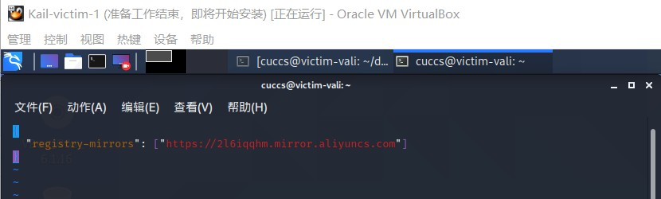
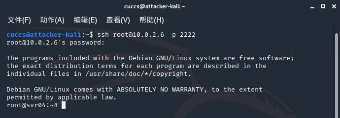

# 常见蜜罐体验和探索

## 实验目的

- 了解蜜罐的分类和基本原理
- 了解不同类型蜜罐的适用场合
- 掌握常见蜜罐的搭建和使用

## 实验环境

- 从paralax/awesome-honeypots中选择 1 种低交互蜜罐和 1 种中等交互蜜罐进行搭建实验
  
  - 推荐 `SSH` 蜜罐

- 网络拓扑环境：
  
  

## 实验要求

- [x] 记录蜜罐的详细搭建过程；
- [x] 使用 `nmap` 扫描搭建好的蜜罐并分析扫描结果，同时分析「 `nmap` 扫描期间」蜜罐上记录得到的信息；
- [x] 如何辨别当前目标是一个「蜜罐」？以自己搭建的蜜罐为例进行说明；

## 实验过程

### 实验一：低交互蜜罐探究

选择蜜罐：ssh-Honeypot

#### 蜜罐的详细搭建过程

首先安装配置docker，执行命令

`sudo apt-get install docker docker-compose`：

准备安装ssh-honeypot，在这之前要确保libssh和libjson-c已经安装，执行命令

`sudo apt install libssh-dev libjson-c-dev`：

配置SSH key，采取不输入密码的方式，执行命令

`ssh-keygen -t rsa -f ./ssh-honeypot.rsa`：

将仓库克隆到本地，执行命令

`git clone https://github.com/random-robbie/docker-ssh-honey`：

进入仓库目录构建镜像，执行命令

`docker build . -t local:ssh-honeypot`

但可以看到，发生了连接超时的错误：

解决方法——登录阿里云，得到一个专属的镜像加速地址，新建/ect/docker/daemon.json文件，将地址填入：

令配置生效，同时重启docker服务：

问题解决，现在镜像构建的就很快了：

接下来运行蜜罐，执行命令

`docker run -p 2234:22 local:ssh-honeypot`：

其中2234为主机端口，22为容器端口

在攻击者主机上对蜜罐进行ssh连接，执行命令

`ssh cuccs@10.0.2.6 -p 2234`：

制造攻击之后，在靶机查看镜像ID：

通过镜像ID进入容器，执行命令

`docker exec -i -t 9ace27d30209 bash`：

进入容器后，通过查询日志分析入侵者的行为，执行命令

`tail -F ssh-honeypot.log`：

此时日志中只有一条初始记录，看样子上次未能连接成功

在攻击者主机重复几次：

此时再查看日志，可以看到输入的密码都被记录在了日志中，同时攻击者的IP与主机名也暴露了：

#### 使用 `nmap` 扫描搭建好的蜜罐并分析扫描结果，同时分析「 `nmap` 扫描期间」蜜罐上记录得到的信息

下面尝试更高级的攻击方式，用nmap扫描靶机：

可以看到，虽然攻击主机发起了2次扫描，可日志中并没有记录下来：

可见，蜜罐的功能比较单一，只能记录下ssh连接情况

#### 如何辨别当前目标是一个「蜜罐」？以自己搭建的蜜罐为例进行说明

该蜜罐的交互性太差，如果发现怎么都无法登录，扫描以后也没有发现端口，基本就可以确定是一个蜜罐了。

### 实验二：中等交互蜜罐探究

选择蜜罐：Cowrie

#### 蜜罐的详细搭建过程

Cowrie的安装相对简单，执行命令

`sudo docker pull cowrie/cowrie`即可：

接下来运行蜜罐，执行命令

`sudo docker run -p 2222:2222 cowrie/cowrie`：

启动以后，蜜罐会等待外界的SSH连接

在攻击者主机发起SSH连接，执行命令

`ssh cuccs@10.0.2.6 -p 2222`：

输入了三次密码，其中包括一次靶机真正的密码，可是均未连接成功

回到靶机，可以看到蜜罐已经记录下了攻击者的IP以及输入的三次密码：

但是为什么该蜜罐还是无法成功连接呢？查询资料以后，发现原来只允许root用户登录，其他用户均无法登录。

改变连接用户，随便输入一个密码，果然成功登录了：

回到靶机，可以看到连接的重点不是密码而是用户，此时已经成功连接，并且攻击者取得了shell：

在一段时间之后，发现SSH连接自动断开了：

这可能也是一种保护措施吧

接下来在攻击者主机做一些操作，探究该蜜罐的交互性：

可以ping通百度：

靶机的日志显示：

使用curl可以成功连接：

靶机的日志显示：

使用apt-get install安装ufw试试：

发现很逼真啊，过程做的像模像样的

再重复一次试试，这时候问题就来了：我不是刚刚才安装过吗？这时候不应该显示该程序已经安装吗，怎么又给安了一次？

再尝试一次，这次干脆把本机的网络给断了，但是蜜罐还是没有反应啊，自顾自的下载了一通，非常有节目效果：

同样，靶机把这一切过程都记录了下来：

#### 使用 `nmap` 扫描搭建好的蜜罐并分析扫描结果，同时分析「 `nmap` 扫描期间」蜜罐上记录得到的信息

在攻击者主机进行nmap扫描，执行命令

`nmap 10.0.2.6 -A -T4 -n -vv`

可以在靶机中看到扫描留下的记录，攻击者的IP、扫描方式、扫描对象、使用端口等信息均已暴露：

#### 如何辨别当前目标是一个「蜜罐」？以自己搭建的蜜罐为例进行说明

该蜜罐的root用户连接是对任意密码都生效的，这一点很容易让人怀疑：不是吧，我运气这么好，一次就中了？另外输入命令的时候不支持命令行补全，这一点也很令人怀疑了。

最明显的部分就是安装程序的部分了，没有考虑过重复安装的情况，并且安装后并不能实际使用，甚至没有联网也能安装。

毕竟要做到与现实环境完全仿真，这个难度确实太大了，Cowrie比起ssh-Honeypot，交互性还是提高了不少档次的。

## 实验总结

检测和识别蜜罐可以从以下几个角度判断：

+ 低交互蜜罐

   + 配置失真与资源抢夺：我们已经知道低交互蜜罐是不能够给敌人提供一个完整的操作系统环境，所以可以通过使用一些复杂的命令和操作，以及一些想不到的输出解决来检查是不是处在蜜罐环境中。

   + 数据包时间戳分析：如果我们仅通过查看网络数据包能很容易的推断出一个机器的物理属性，我们就很有可能辨别物理服务器和虚拟蜜罐。事实证明，TCP提供了一些直接反映底层服务器状态的信息。TCP时间戳选项被网络堆栈用于确定重传超时时间。机器中的无历史中安特定频率更新时间戳，我们也知道，所有的物理时钟都有一定时钟偏差，他们或多或少于实际运行时间。

   + 环境不真实导致穿帮：我们很容易就能知道进行物理机器应有的配置，版本号等信息，而搭建的蜜罐往往在这方面做的不够完善，容易露陷

+ 高交互蜜罐
  
   + 检测和禁用sebek。

   + 检测蜜墙：如果入侵者利用蜜网作为跳板攻击第三方系统，大多数蜜网的管理员理当害怕承担责任。因此，他们使用两种常用的技术来最小化成功攻击第三方系统的的风险：首先极其严格的限制出战连接数，每天只允许15个出站TCP链接。不幸的是，这种控制出站流量的极端措施很容易检测蜜罐的存在。
  
   + 逃避蜜网记录：我们应该去考虑降低日志的使用价值，攻击者可以使记录的数据无法理解，或者是日志记录本身不可靠，或者采用一些方法式的攻击行为根本不会被记录。我们可以尝试着攻击日志主机，并从日志主机中擦除数据，但是通常不可行，如果我们加密所有的网络通信，一个被动的或者外部的系统将不能从他获得任何有异议的内容。这样做的主要问题是对目标的初始漏洞利用通常是不可能加密的。

## 参考资料

+ [师姐文档](https://github.com/CUCCS/2019-NS-Public-chencwx/blob/ns_chap0x11/ns_chapter11/README.md)
+ [实验参考](https://c4pr1c3.github.io/cuc-ns/chap0x11/exp.html)
+ [如何判断是不是进入了蜜罐](https://www.zhihu.com/question/31213254)