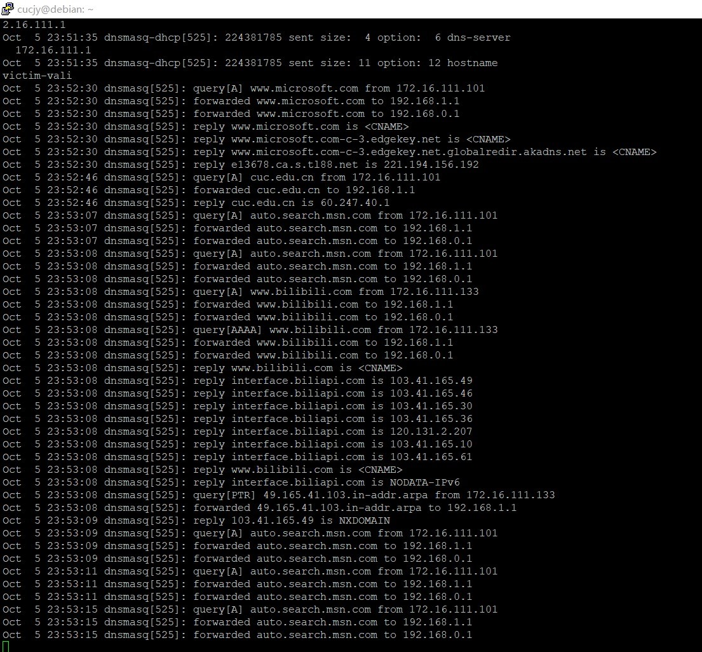
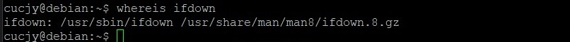

# 基于 VirtualBox 的网络攻防基础环境搭建

## **实验环境及设备配置**  
* 一台网关：    
  * Debian-Gateway，IP为10.0.2.15
  

* 两个内部网络子网：intnet1：（网关IP为172.16.111.1）
    * 一台Windows XP系统的靶机：xp-victim-1，IP为172.16.111.101
    
    * 一台kali系统的靶机: Kail-victim-1，IP为172.16.111.133
    
* intnet2：（网关IP为172.16.222.1）
    * 一台Windows XP系统的靶机：xp-victim-2，IP为172.16.222.109
    
    * 一台ubuntu系统的靶机:  Ubuntu-victim-2，IP为172.16.222.138（这里本来是准备装debian系统的，但在安装及使用中出现了种种问题，在装了3次系统后我还是无奈选择了Ubuntu）
    
* 一台攻击者主机：  
    * Kail-Attacker，IP为10.0.2.4
    

# 实验过程

## 配置网关

首先修改/etc/network/interfaces如下：


重启网络。

然后安装dnsmasq，在/etc/dnsmasq.d添加两个配置文件，以便子网分配IP：


## 为靶机配置IP

XP在网络连接中心直接点击修复网络即可自动分配IP。

Kail会自动寻找dhcp服务器分配，也无需手动操作。

Ubuntu需要修改/etc/network/interfaces，添加：
```
auto enp0s3
iface enp0s3 inet dhcp
```
然后重启网卡：`/etc/init.d/networking restart`即可成功分配IP。


# 实验结果

 - [x] 靶机可以直接访问攻击者主机
      * intnet1内的xp-victim-1：
  
    

      * intnet1内的Kail-victim-1：
  
    

      * intnet2内的xp-victim-2：
  
    

      * intnet2内的Ubuntu-victim-2：
* 
    

    - [x] 攻击者主机无法直接访问靶机
    

    - [x] 网关可以直接访问攻击者主机和靶机
      * 访问攻击者主机：

    
      * 访问靶机：
  
    

    - [x] 靶机的所有对外上下行流量必须经过网关
      * intnet1：XP访问cuc官网，Kail同时ping www.bilibili.com。
  
    
      * intnet2：Ubuntu通过Firefox访问知乎，XP同时ping wwww.zihhu.com。这里由于数据太多未能截全。
  
    

      
    - [x] 所有节点均可以访问互联网
  
        这里我以能否ping通百度作为标准。
      * 网关：
    
      * xp-victim-1：
    
      * Kail-victim-1：
    
      * xp-victim-2：
    
      * Ubuntu-victim-2：
    
      * Kail-Attacker：
    


# debian修错记录：

在这里记录一些实验中遇到的小坑。

1. 安装增强功能时报错：无法定位程序


查询后得知要更新软件源。

在执行sudo命令时出错：


查询得知需要修改文件/etc/sudoers：

在如图所示位置增加一行：xx ALL=(ALL) ALL  (此处的XX即为出现问题的用户名）即可解决。

2. 桌面版发生了“无法解析域名”的错误，多次尝试无果，无奈改换为命令行版。在执行ifdown命令时报错：bash: ifdown:未找到命令。

起初我以为是该命令尚未安装，查询得知debian中安装ifdown的命令为：sudo apt-get install ifupdown2。但执行后发现原系统就安装有ifdown命令，安装ifupdown2时会先将ifupdown卸载掉，但我在这一步卡了将近一个小时仍未卸载成功，无奈放弃。

通过whereis命令得知ifdown的安装位置：


vim .bashrc，在末尾修改环境变量：


修改后执行source ~/.bashrc后生效，ifdown命令可正常使用。