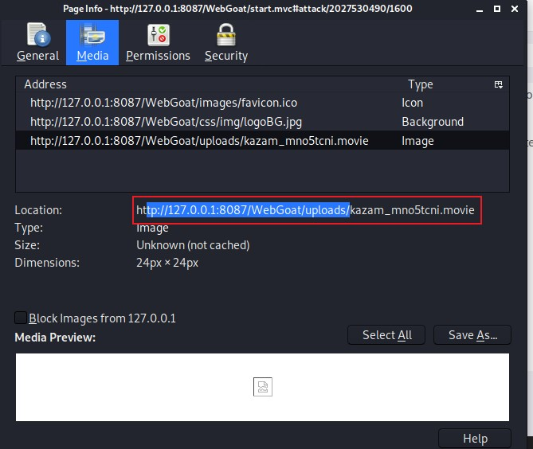
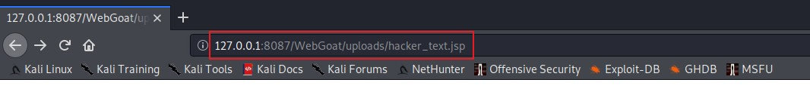
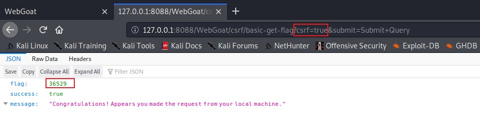
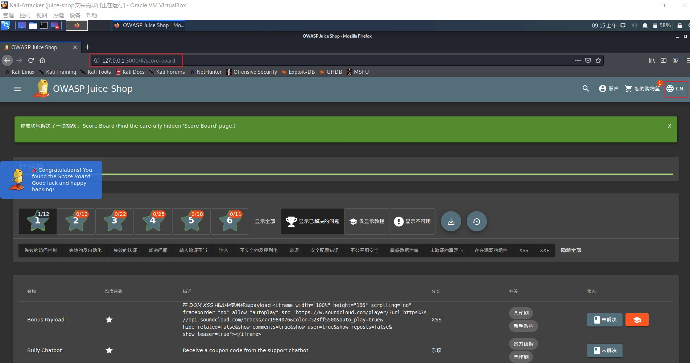

# Web 应用漏洞攻防

## 实验目的

- 了解常见 Web 漏洞训练平台；
- 了解 常见 Web 漏洞的基本原理；
- 掌握 OWASP Top 10 及常见 Web 高危漏洞的漏洞检测、漏洞利用和漏洞修复方法；

## 实验环境

- WebGoat7.1/8.0
- Juice Shop

## 实验要求（完成度）

- [x] 每个实验环境完成不少于 **5** 种不同漏洞类型的漏洞利用练习；
- [x] （可选）使用不同于官方教程中的漏洞利用方法完成目标漏洞利用练习;
- [x] （可选）**最大化** 漏洞利用效果实验；
- [x] （可选）编写 **自动化** 漏洞利用脚本完成指定的训练项目；（使用工具:burpsuite）
- [x] （可选）定位缺陷代码；
- [x] （可选）尝试从源代码层面修复漏洞；

## 实验前的准备  

安装docker环境：

`sudo apt-get install docker docker-compose`

安装并配置webgoat：

`git clone https://github.com/c4pr1c3/ctf-games.git --recursive`

`cd owasp/webgoat/ && docker-compose up -d`

webgoat配置结果展示：

安装并配置juice shop：

`cd owasp/juice-shop/ && docker-compose up -d`

juice shop配置结果展示：

配置burpsuite：

将intercept设置为off

设置代理，确保训练环境的网络上下行流量都经过代理服务器：

同时在浏览器端使用FoxProxy设置对应地址的代理：

## WebGoat漏洞实战

登录WebGoat7.1版本

登录WebGoat8.0版本

与7.1版本不同的是要先进行注册

成功登录

### 漏洞类型1：文件上传漏洞

实验版本：7.1

漏洞路径：`Malicious Execution -> Malicious File Execution`

个人理解：网站要求使用者上传指定类型的文件如图像等，但又不对上传的文件做类型判断，这就留下了漏洞，攻击者完全可以上传木马等恶意文件来破坏网站。

该问题需要我们上传一个文件，在指定目录创建一个webgoat.txt文件即为成功。

首先随意上传一个文件，在网站给出的图像预览框处右键，选择图中选项：

观察到文件上传后的储存地址是../WebGoat/uploads/，在上传文件后需以此为基准运行脚本。

如图，此为制作完成的.jsp文件。

上传后，切换到该页面运行脚本即可成功：

至此，该漏洞实战完毕。

### 漏洞类型2：脆弱的访问控制

实验版本：7.1

漏洞路径：`Session Management Flows -> Session Fixation`

个人理解：由于未采用Session、cookie，⽽是在URL中编码已通过认证的用户名和密码，可能会导致攻击者可以破坏密码，密钥，会话令牌或实施漏洞冒充其他用户身份，服务器通过每个用户的唯一的Session ID 来确认其合法性。如果用户已登录，并且授权他不必重新验证授权时，当他重新登录应用系统时，他的Session ID 依然是被认为合法的。在一些程序中，可能会在GET-REQUEST 请求中传递Session ID。这就是攻击的起点。

#### Stage 1

该问题要求输入SID，用于获取到受害者的session。

首先在如图所示位置添加SID，可以是任意数值。

#### Stage 2

Stage1成功，可以看到cookie已经和我们事前设定的SID值相同了，在这一步只需要点击链接即可。

#### Stage 3

现在我们进入到受害者界面了，这一步只需根据它给出的提示将用户名和密码输入并提交即可。

#### Stage 4

这一步攻击者准备获取session。

点击链接后进入该页面，将导航栏URL中的`SID=`后的数值改为预先输入的SID值，可以看到，已经获取了受害者的session了。

至此，该漏洞实战完毕。

### 漏洞类型3：SQL注入

实验版本：7.1

漏洞路径：`Injection Flaws -> LAB:SQL Injection`

个人理解：SQL注入针对的是程序员编写时的疏忽，通过构建特殊的输入作为参数传入Web应用程序，而这些输入大都是SQL语法里的一些组合，通过执行SQL语句进而执行攻击者所要的操作，其主要原因是程序没有细致地过滤用户输入的数据，致使非法数据侵入系统。

#### Stage 1

该问题需要我们使用字符串SQL注入绕过认证。使用SQL注入以Boss(“Neville”)登录而不需要正确的密码。验证Neville的简介可被查看，所有其他功能可用（包含查询、创建和删除）。

首先拦截此次请求所发的包：

将password的值改为`'or'1'='1`：

重发，可以看到返回了下一阶段的页面。此时我们没有输入密码也成功登录了，SQL注入成功。

#### Stage 2

该问题需要我们修改源码来阻止SQL注入，但我目前只知道通过页面的Show Source按钮查看源码，此问题难度确实较大，不得不暂且放弃(＠_＠;)

#### Stage 3

该问题需要我们绕过认证执行SQL注入。作为正常员工“Larry”，在查看功能（从员工列表页）的参数里使用SQL注入查看boss（“Neville”）的简介。

仿照Stage 1的做法，首先利用SQL注入登录目标页面，然后点击图示按钮：

拦截此次请求所发的包：

将employee_id的值修改为`101 or 1=1 order by salary desc`：

重发，可以看到返回了下一阶段的页面，SQL注入成功。

#### Stage 4

该问题与Stage 2类似，通过修改源码来修复此SQL注入漏洞，理由同上暂且放弃。

至此，该漏洞实战完毕。

### 漏洞类型4：未验证的用户输入

实验版本：8.0

漏洞路径：`Client side -> Bypass front-end restrictions`

个人理解：Bypass front-end restrictions即绕过前端限制，简单的说就是绕过HTML，CSS，Javascript的限制，这个限制可能是对参数的格式要求，也可能是对文件后缀的要求等等。

#### Stage 1

根据题目描述，我们需要发送绕过所有这四个字段限制的请求才算通过。首先点击submit按钮，显示结果并不正确：

在BurpSuite中抓到该POST请求的包：

将输入修改为任意值，使用Repeater功能进行重放，观察到返回成功过关的显示：

#### Stage 2

根据题目描述，我们需要将所有字段中的值修改为不符合标注的正则式才算通过。

和stage1的思路一样，首先抓到该请求的包：

然后再将输入修改并重放，显示成功：

至此，该漏洞实战完毕。

### 漏洞类型5：XSS

实验版本：8.0

漏洞路径：`Cross Site Scripting(XSS) -> Cross Site Scripting`

个人理解：XSS的产生原因是没有控制好用户的输入，让用户的输入可以添加到html页面中，如果用户的输入为js代码，就造成了html页面的js代码执行，js代码执行就会造成信息泄露等等。

如图所示，该漏洞共有5个挑战。

#### Stage 2

该问题是问在浏览器中两个tab中同一个网站的cookie是否一样，通过在浏览器导航栏中输入：`javascript:(document.cookie)`，查看cookie来实现。
 

我在Firefox中尝试了几遍，不知为何没有弹出cookie的值，转而在chrome中尝试：

可以看出，两个tab中同一个网站的cookie确实是一样的。

在回答中输入`yes`，继续下一题。

#### Stage 7

该问题是一个最简单的反射型xss攻击尝试，直接在提交表单中的一项输入：``，提交后出现弹窗提示，XSS攻击成功。

#### Stage 10

该问题提醒我们，通常可以通过在客户端代码中查找路由配置来找到基于DOM的XSS。

观察该页面的路由，可以发现所有的内容都是从start.mvc#开头的，不同的页面之间只是在这之后有差别。“基本路由”为：start.mvc＃lesson/，之后的CrossSiteScripting.lesson/9是由JavaScript路由处理程序处理的参数。

我们需要找到的就是该JavaScript路由处理程序，看看它是怎么处理路由的。

进入开发者模式，在Debugger中查找JavaScript源，我观察了所有的js文件名，只有`GoatRoute.js`这一个看上去和路由有关系。打开这个文件，可以看到一个与`text`有关的路由：

将该路由输入提交框中，成功。该路由即为base route。

#### Stage 11

该问题在上一问的基础上进行，我们需要尝试通过在导航栏中输入URL调用页面编写时的函数。

以之前找到的base route为URL，在导航栏中输入：`127.0.0.1:8080/WebGoat/start.mvc#test/`，进入开发者模式，调用`webgoat.customjs.phoneHome()`函数，可以看到系统返回了一串随机值。

将该值输入提交框中，成功。

#### Stage 12

该问题只是做简单的选择题，就不在此详细说明了，只讲一下对XSS的理解：

Q：可信网站是否可以抵抗XSS攻击？A：否，因为如果被确认为受信任的浏览器信任该网站，则该浏览器不知道该脚本是恶意的。

Q：XSS攻击何时发生？A：数据包含在发送给Web用户的动态内容中，而未经验证是否包含恶意内容时发生。

Q：什么是存储的XSS攻击？A：该脚本永久存储在服务器上，并且受害者从服务器请求信息时会收到恶意脚本。

至此，该漏洞实战完毕。

### 漏洞类型6：CSRF

实验版本：8.0

漏洞路径：`Request Forgeries -> Cross-Site Request Forgeries`

个人理解：跨站请求伪造，从字面意思上讲，就能知道是跨过一个站，也就是在一个站点，伪造另外一个站点的请求。最简单的例子就是你访问黑客的网站，但是网站里伪造了某某银行的转账请求，一旦该银行转账请求存在CSRF漏洞，那钱就都被黑客转走了。CSRF通常具有以下特征：它涉及依赖用户身份的网站。它利用该网站对该身份的信任。它诱骗用户的浏览器发送HTTP请求到目标站点。

#### Stage 3

这是一个基本的CSRF练习，登录时从外部来源触发表单：

点击Submit Query框后，跳转到该页面，可以看到当前csrf的值为false，flag的值为null：

将csrf的值修改为true，重新进入页面，就得到了flag的值：

将flag的值提交，成功：

#### Stage 4

这道题目原意是让你写一个攻击页面，然后其他用户访问这个页面后，就会在留言板留言一条，但是这在程序判断上不好实现，所以此题目是判断你提交留言的包里host值和referer值是否一样，不一样则通过。

首先点击留言框，截获到此次请求的包：

修改包的Host和Referer地址，使其不一样即可：

重发，观察到返回成功提示：

#### Stage 7

本题目展示了如何攻击未受保护的API。

首先编写一个如图所示的html：

在浏览器中打开，进行本地访问获取flag：

将flag的值提交，成功：

#### Stage 8

这一题按照题目要求，注册个csrf-开头的用户，例如我的原用户名为cuccs-jy，然后我再注册一个csrf-cuccs-jy,然后登录csrf-cuccs-jy访问这道题目，点击solved就过了。当然这题的真实目的是希望你构建一个csrf 恶意链接，然后访问这个链接就会自动登录csrf-cuccs-jy这个账户，这样受害者的访问记录你就都知道了。

成功：

至此，该漏洞实战完毕。

## Juice Shop漏洞实战

使用3000端口访问Juice Shop：

使用前需要先注册用户：

乍一看，这还真是个饮品店，所以我们首先要找到实验的入口：被隐藏起来的计分板。查找页面的源代码：

进入图示的URL，这是真正的实验界面了，为了显示方便，我把界面语言调成了中文：

现在，准备开始Juice Shop的实验吧！

### 漏洞类型1：XSS

漏洞名称：`DOM XSS`、`Bonus Payload`

#### 解决过程：

这个漏洞很简单了，就是一个最基础的反射型XSS，直接在搜索框里输入语句`<iframe src="javascript:alert('xss')">`：

这个漏洞是上一个的进阶，因为彼此相似，我就一块处理了，输入语句`payload <iframe width="100%" height="166" scrolling="no" frameborder="no" allow="autoplay" src="https://w.soundcloud.com/player/?url=https%3A//api.soundcloud.com/tracks/771984076&color=%23ff5500&auto_play=true&hide_related=false&show_comments=true&show_user=true&show_reposts=false&show_teaser=true"></iframe>`即可：

至此，该漏洞实战完毕：

### 漏洞类型2：安全配置错误

漏洞路径：`Error Handling`

#### 解决过程：

进入登录页面，在电子邮件那一栏中输入`'`，然后随意输入一个密码：

啊这，就这么通过了，怎么跟提示上的不一样啊，不是应该弹出一个错误提示框吗？

我搜寻了一下资料，本来应该有如下显示：

获得该显示最主要的目的是得到它的SQL语句，为接下来的注入提供方便。

至此，该漏洞实战完毕：

### 漏洞类型3：注入

漏洞路径：`Login Admin`

#### 解决过程：

此处需要用到上一个漏洞获取的情报，该处完整的SQL语句应该是：
`select * form Users where email='' and password='md5(password)'`

根据该逻辑即可构造出注入语句：`' or 1=1 --`

可以看到，成功登录到了管理员用户：

至此，该漏洞实战完毕：

### 漏洞类型4：敏感数据泄露

漏洞名称：`Confidential Document`

#### 解决过程：

首先，点击`关于我们`按钮

进入该页面，发现作者很皮啊，在里面藏了个链接：

以右键打开新页面的方式打开链接，可以看到存在`./ftp/`这条路径，合理猜测这个URL后应该有什么东西：

访问该URL，点击第一个文件，就实现了敏感数据泄露：

至此，该漏洞实战完毕：

### 漏洞类型5：失效的访问控制

漏洞名称：`Easter Egg`

#### 解决过程：

首先，利用已知情报进入/ftp路径，发现有个名为eastere.gg的文件，一看这个名字，合理推测这就是我们要找的Easter Egg，点击右键在新页面打开文件：

但是直接访问无法打开该文件，需要用截断的方法获取文件内容，输入图示的URL：

顺利打开了文件，发现该彩蛋的核心部分是一串乱码，显然这里采用了加密手段：

分析得知该编码为base64位编码，选择一款解码器进行解码：

获得一串URL：`/gur/qrif/ner/fb/shaal/gurl/uvq/na/rnfgre/rtt/jvguva/gur/rnfgre/rtt`，访问该路径，但是发现什么也没有：

至此，该漏洞实战完毕：

并且在途中顺便完成了另一个任务，一石二鸟啊。推测该漏洞应该是在通过截断方法获取文件时完成的：

### 漏洞类型6：加密问题

漏洞名称：`Nested Easter Egg`

#### 解决过程：

看到这个我先是一楞，这玩意不是做完了吗，好家伙还带二次加密的。不过仔细观察一下，这个URL：`/gur/qrif/ner/fb/shaal/gurl/uvq/na/rnfgre/rtt/jvguva/gur/rnfgre/rtt`，确实是有点不对劲，路径应该能让人看出含义才对，这个路径也有点乱码的意思。

直觉观察应该是像凯撒密码那样的替换密码，搜寻资料后发现是ROT13密码：

用一款解码器进行解码，得到真正的URL：

访问该地址，可惜还是啥都没访问到，不过系统已经显示通过了：

至此，该漏洞实战完毕：

### 漏洞类型7：输入验证不当

漏洞名称：`Upload Type`

#### 解决过程：

首先访问URL：`127.0.0.1:3000/#/complain`，可以看到该投诉页面允许上传文件：

指定上传文件的格式为pdf，并且大小不能超过100kb：

上传一个文件进行测试：

根据抓到的包可以看出，上传的投诉被分为了两个部分，这部分为消息框中填写的信息：

这部分为上传的pdf文件信息：

观察包信息，修改文件名的后缀并重发：

观察到成功反馈：

至此，该漏洞实战完毕：

## 实验总结

各种常用漏洞类型原理及解决办法总结：

  | 漏洞类型           | 主要成因                                                     | 解决办法（理论，代表性）                                     |
  | ------------------ | ------------------------------------------------------------ | ------------------------------------------------------------ |
  | 未验证的用户输⼊   | 网站只在客户端进⾏输⼊验证，过滤时未进⾏规范化               | 服务器返回给客户端的重要参数、赋值使用，HMAC进⾏参数签名     |
  | 缓冲区溢出         | 应用程序的缓冲区中存在过量的输⼊数据，溢出的数据中包含恶意指令且恶意指令被精确填充到可执⾏堆/栈（内存）中进⽽导致恶意代码被执⾏ | 避免使用本地代码，避免直接调用本地应用程序，Java虚拟机的安全更新补丁，PHP语⾔的安全更新补丁限制Web应用程序的运⾏权限 |
  | sql注入            | 登录模块使用了如下的SQL查询语句，很容易被用户输⼊破解登录功能 | 在任何时候避免直接使用外部的解释器，⽽使用编程语⾔提供的API库，在将数据发送给后台程序时对数据进⾏编码 |
  | XSS攻击            | 攻击者将恶意脚本代码发送到终端用户的浏览器                   | 要确保用户不能提交恶意脚本代码                               |
  | 不恰当的错误处理   | 程序的错误消息会暴露程序的⼀些实现细节                       | 定义⼀套清晰和⼀致的错误处理机制等                           |
  | 脆弱的访问控制     | 内容或程序功能未能有效的保护以限制只允许合法用户的访问       | 对每个需要保护的请求进⾏检查，不仅是在用户第⼀次请求时进⾏检查等 |
  | 脆弱认证和会话管理 | 未采用Session cookie，⽽是在URL中编码已通过认证的用户名和密码 | 使用强认证机制                                               |
  | 不安全的存储       | 敏感/重要的数据未采取安全的存储⽅式                          | 仅存储那些必须存储的数据，不允许对后台应用程序的直接访问，不要在Web应用程序服务器所在的根目录存储重要⽂件 |
  | 不安全的配置管理   | 未及时更新安全补丁等                                         | 为每一个服务器创建一个安全标准                               |
  | 拒绝服务攻击       | Web应用程序非常容易遭受拒绝服务攻击，这是由于Web应用程序本身⽆法区分正常的请求通信和恶意的通信数据 | 避免可能会导致资源密集性消耗的请求                           |
  | 跨站点请求伪造     | 利用站点已验证通过的用户会话                                 | 使用GET⽅法进⾏查询操作，使用POST⽅法进⾏更新操作            |
  | PHP的⽂件包含漏洞  | PHP代码的⽂件包含指令中含有动态变量参数， 该参数会被攻击者恶意控制实现动态包含任意⽂件 | 严格检查变量是否已经初始化                                   |
  | ⽂件上传漏洞       | 允许用户上传⽂件可能会让⿊客上次恶意文件                     | 定义⽂件名白名单，上传文件后统一命名                         |

## 参考资料

+ [WebGoat8.0](https://blog.csdn.net/m0_46232048/article/details/104483674)

+ [WebGoat7.1](https://www.bbsmax.com/A/B0zq1OPnzv/)

+ [Juice Shop](https://www.freebuf.com/news/155019.html)

+ [师姐的参考报告](https://github.com/CUCCS/2019-NS-Public-chencwx/blob/ns_chap0x07/ns_chapter7/Web%20%E5%BA%94%E7%94%A8%E6%BC%8F%E6%B4%9E%E6%94%BB%E9%98%B2.md)