# 实验三：无线网络攻防独立实验之一  PSK破解实验

# 实验目的

- 理解 WPA/WPA2 PSK 认证方式的认证凭据破解原理并了解使用常见工具进行 PSK 口令破解的基本方法；

# 实验环境

本次实验用于"开启监听模式的网卡"正反面高清照片如下：

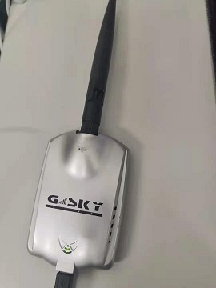

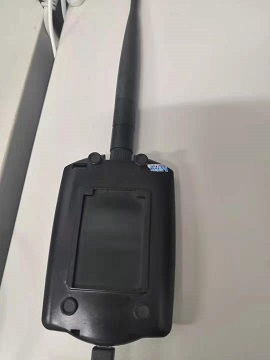

本次实验用于"开启监听模式的网卡"硬件和软件特性支持情况如下：

本次实验用于"搭建被攻击网络所需要使用到的「无线 AP」"正反面高清照片如下：

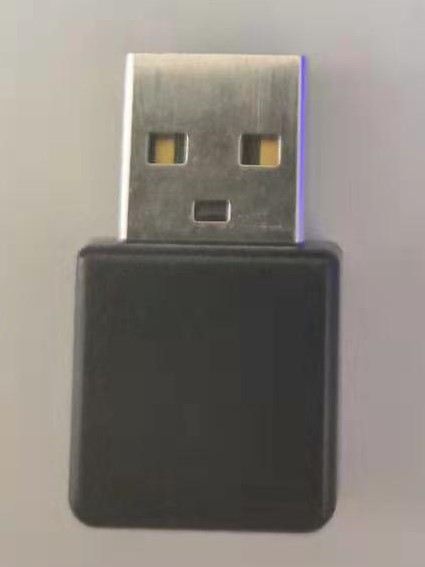

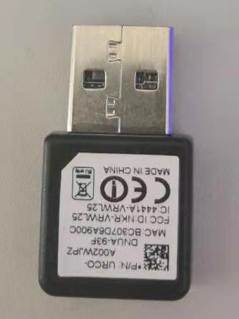

本次实验用于"搭建被攻击网络所需要使用到的「无线 AP」"硬件和软件特性支持情况如下：

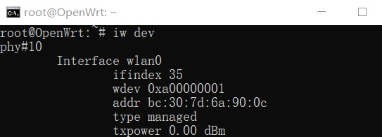

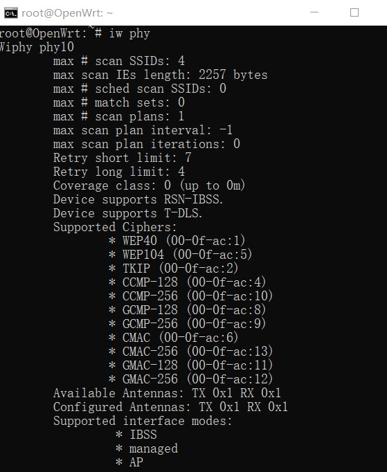

本次实验所用无线网络环境的配置如下：

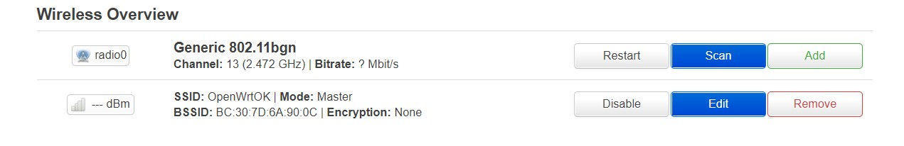

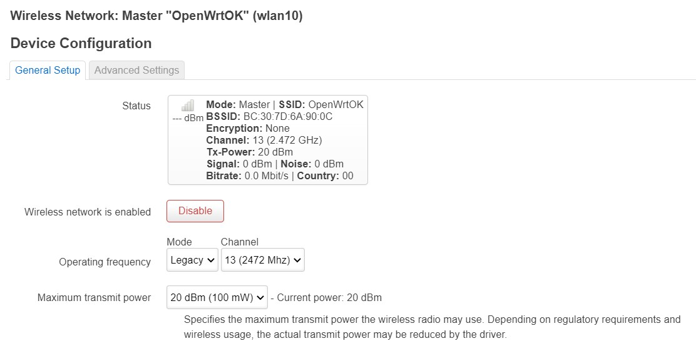

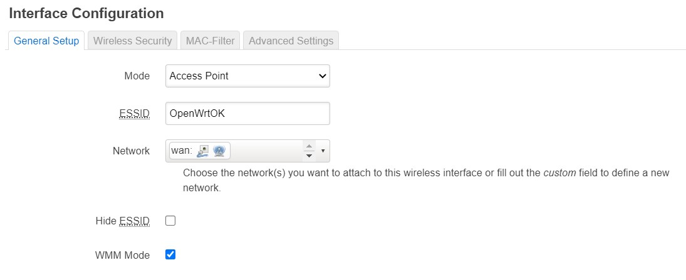

# 实验要求

- 实验对象严格限制为「自行搭建」的实验专用无线网络，不得对他人正常使用的无线网络造成负面影响；
- 实验报告附件材料应包括：
    - 实验中「捕获」的 实验相关 无线数据抓包文件；

# 实验过程

首先将网卡开启监听模式，扫描周边环境，观察到本次实验被攻击网络的channel为11：

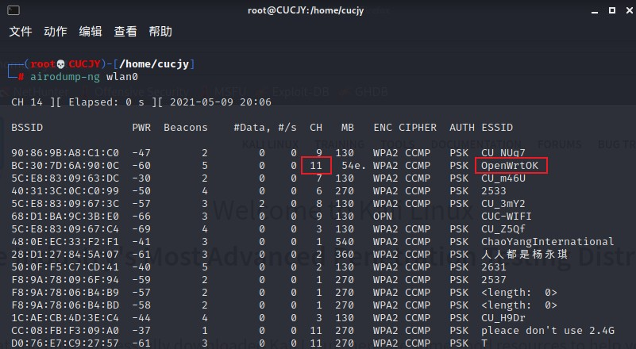

接着针对该信道进行抓包，执行命令`airodump-ng -c 11 -w first wlan0`：

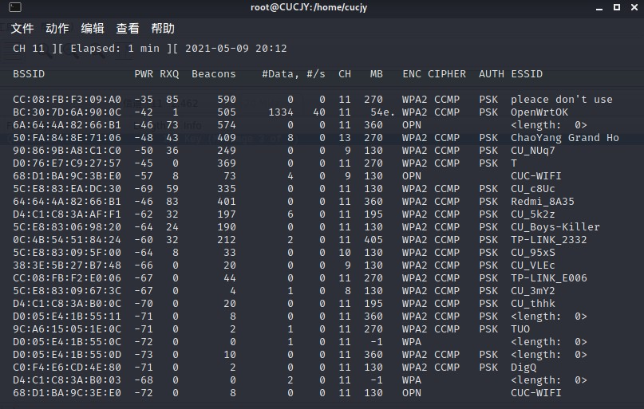

抓包的时候要注意，一定要先断开网络，启动抓包之后再连接上，这样才可能抓到4个握手包，本次实验重复了多个断开重连过程，因此抓到的包比较杂乱：

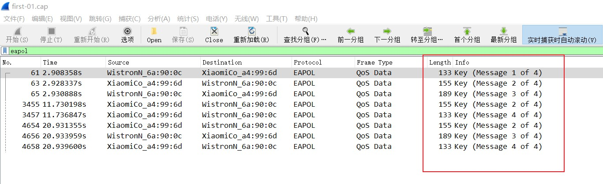

已经抓到了握手包，接下来尝试暴力破解密码，也就是将握手包的密码与密码字典进行匹配

kali系统在/usr/share/wordlists目录下应该有现成的字典文件，但可能是版本的问题，我的kali没有这么个文件夹：

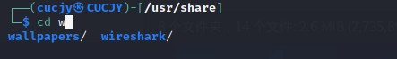

这就比较尴尬了，只好用crunch自己生成口令字典文件，我按需生成了一个由8位数字组成的随机密码字典，执行命令：

`crunch 8 8 0123456789 -o ~/password.txt`

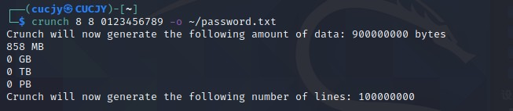

看得出来数量相当大啊，800多M......

接下来正式开始破解，执行命令：`aircrack-ng -w password.txt first-01.cap`，静静等待，直到得出结果：

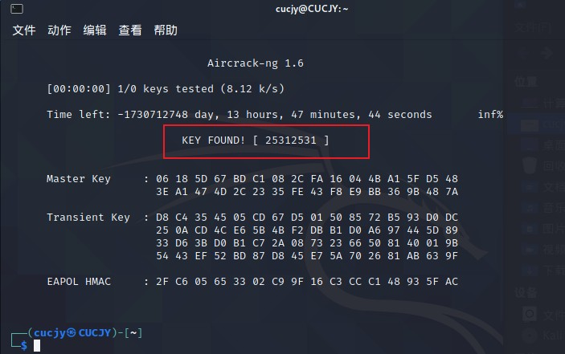

如图所示，PSK口令破解成功

# 实验总结

WPA和WPA2使用从EAPOL握手派生的密钥来加密流量，EAPOL握手是在计算机加入Wi-Fi网络时发生的。除非要解密的会话存在所有四个握手数据包，否则将无法解密流量

因此PSK能够成功破解的关键就是抓到4个EAPOL握手包：

# 实验遇到的问题及解决方法

本实验最大的问题是很难同时抓到4个握手包（这里要吐槽一下，真是玄学问题），抓不到就只能继续抓......

最终采取的方法是用de-auth攻击强制已连接的客户端下线，用这种方法需要已知AP的MAC地址和连接客户端的MAC地址，语法是：

`aireplay-ng -0 0 -a 目标的MAC地址 -c 目标客户端MAC wlan0`

# 参考文献

[老师课本](https://c4pr1c3.github.io/cuc-mis/chap0x03/homework.html)

[Kali Linux使用crunch生成密码字典](https://blog.csdn.net/ghl1390490928/article/details/81485392)

[wireshark如何解密802.11](https://wiki.wireshark.org/HowToDecrypt802.11)